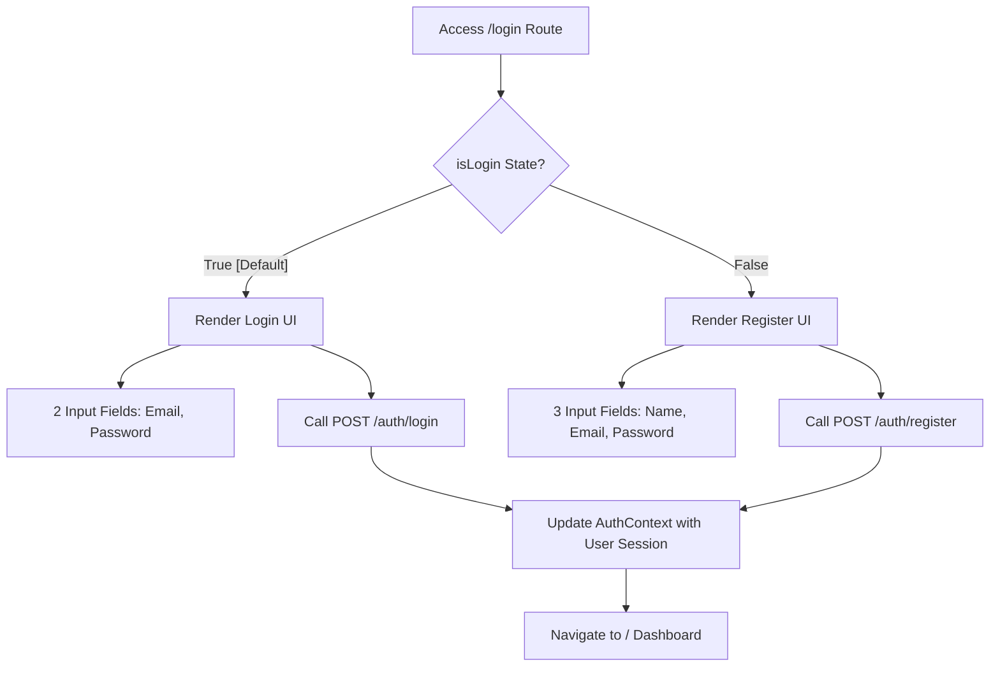
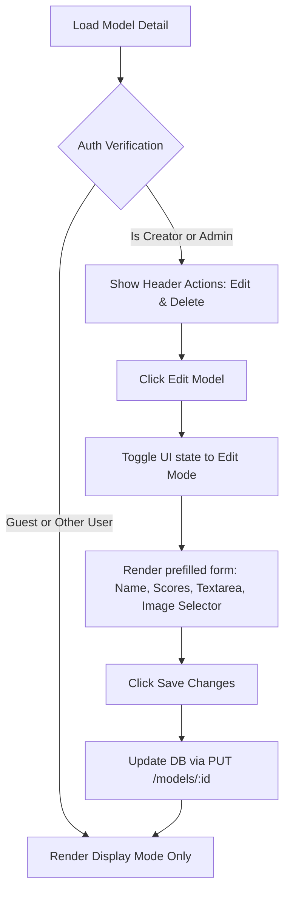

# 🖥️ SpatialAblate Client Pages Directory & Specification

This documentation provides an exhaustive, page-by-page breakdown of the frontend client architecture for **SpatialAblate**. It details all user interfaces, listing paths, visual layouts, text copies, input fields, interactive forms, and operational buttons.

---

## 🗺️ Page Mapping at a Glance

Below is a quick-reference index of routes and their corresponding component files:

| Page Name | Route Path | Component File | Auth Level | Key Components & Libraries |
| :--- | :--- | :--- | :--- | :--- |
| **Global Navigation Shell** | *All Routes* | [App.jsx](file:///Users/assadullahimran/developer/running_project/LeaderBoard/client/src/App.jsx) | Public (Context-Driven) | Lucide Icons, Context Providers |
| **Leaderboard Dashboard** | `/` | [Dashboard.jsx](file:///Users/assadullahimran/developer/running_project/LeaderBoard/client/src/pages/Dashboard.jsx) | Public / Reader | HTML5 Table, Rank Badges, Sorting |
| **Login & Register** | `/login` | [Login.jsx](file:///Users/assadullahimran/developer/running_project/LeaderBoard/client/src/pages/Login.jsx) | Anonymous Guest | Form, Switch state toggler, AuthContext |
| **Submit Model** | `/submit` | [SubmitModel.jsx](file:///Users/assadullahimran/developer/running_project/LeaderBoard/client/src/pages/SubmitModel.jsx) | Authenticated Author | Custom Searchable Combobox, Live Preview Tab, Markdown/LaTeX Parser |
| **Model Detail (View/Edit)** | `/models/:id` | [ModelDetail.jsx](file:///Users/assadullahimran/developer/running_project/LeaderBoard/client/src/pages/ModelDetail.jsx) | Owner (Edit) / Public (View) | Mermaid.js, ReactMarkdown, LaTeX, Edit Form, Image Manager |

---

## 🛡️ 1. Global Navigation Shell
* **Component Path**: [App.jsx (Navigation component)](file:///Users/assadullahimran/developer/running_project/LeaderBoard/client/src/App.jsx)
* **Access**: Automatically rendered at the top of every page layout.

### 🎨 Layout & Visual Aesthetics
A clean, responsive header block styled with a border divider. Features automatic transitions for dark/light mode integration (`bg-white dark:bg-slate-800 border-b border-slate-200 dark:border-slate-700`).

### 💬 Texts
* **System Brand Logo**: `"SpatialAblate"` (Links back to `/`)
* **Menu Options**:
  * `"Dashboard"` (Links to `/`)
  * `"Submit Model"` (Links to `/submit`)
* **User Session Status Indicator** (Visible only if logged in):
  * Displays active user's name: `"{user.name}"`
  * Features a styled badge wrapper (`bg-slate-100 dark:bg-slate-700/80 border border-slate-200 dark:border-slate-600`) with a pulsating green status dot (`h-2 w-2 rounded-full bg-green-500 animate-pulse`).

### ⚙️ Input Fields
* *None*

### 🔘 Buttons & Click Actions
1. **Dark Mode Toggle Button**
   * **Visuals**: Dynamic light/dark icon button (`p-2 border rounded-lg bg-slate-100 dark:bg-slate-700 cursor-pointer`).
   * **Icons**: 
     * Dark Mode active: `<Sun className="h-4.5 w-4.5 text-yellow-400 fill-yellow-400" />`
     * Light Mode active: `<Moon className="h-4.5 w-4.5 text-slate-700" />`
   * **Action**: Calls `toggleTheme()` from the global `ThemeContext` to invert system-wide styling immediately.
2. **Dynamic Authentication Action Button** (Context State Dependent)
   * **Scenario A: Logged Out**
     * **Button Text**: `"Login"`
     * **Aesthetics**: Blue CTA button (`bg-blue-600 hover:bg-blue-500 text-white font-semibold shadow-md shadow-blue-900/20 hover:scale-102 transition-all`).
     * **Action**: Acts as a hyperlink routing the user to the `/login` page.
   * **Scenario B: Logged In**
     * **Button Text**: `"Logout"`
     * **Aesthetics**: Soft red border styled button (`bg-red-50 hover:bg-red-600 dark:bg-red-600/20 dark:hover:bg-red-600/90 text-red-650 dark:text-red-200 hover:text-white px-3.5 py-1.5 border-red-200 dark:border-red-500/30 cursor-pointer transition-all`).
     * **Action**: Calls the `logout()` method in `AuthContext`, wiping storage tokens, logging the user session out, and instantly refreshing the navigation layout.

---

## 🔑 2. Login & Register Page
* **Component Path**: [Login.jsx](file:///Users/assadullahimran/developer/running_project/LeaderBoard/client/src/pages/Login.jsx)
* **Route Path**: `/login`

> [!NOTE]
> This screen behaves as a unified portal using a local boolean state switcher (`isLogin`). Depending on whether the user selects Login or Register, the UI changes labels, inserts additional fields, alters validation, and targets the corresponding endpoint.

### 🎨 Layout & Visual Aesthetics
Centered layout card (`max-w-md mx-auto mt-20`) using high-contrast borders and premium rounded corners. Transitions seamlessly under theme switches.

### 💬 Texts
* **Main Heading**:
  * Login Mode: `"Login to SpatialAblate"`
  * Register Mode: `"Create an Account"`
* **Input Labels**: `"Name"` *(Register Mode only)*, `"Email"`, `"Password"`
* **Submit Button Copy**: `"Login"` *(Login Mode)* / `"Register"` *(Register Mode)*
* **Footnote Redirection Context**:
  * Login Mode: `"Don't have an account? "`
  * Register Mode: `"Already have an account? "`
* **Mode Toggler Text Button**: `"Register"` *(Login Mode)* / `"Login"` *(Register Mode)*

### ⚙️ Input Fields

| Label | Input Name | Type | Validation / Requirements | Styling Class |
| :--- | :--- | :--- | :--- | :--- |
| **Name** *(Register Only)* | `name` | `text` | Required only when `!isLogin` is active. | `w-full bg-slate-50 dark:bg-slate-900 border border-slate-350 dark:border-slate-650 rounded px-4 py-2 text-slate-900 dark:text-white focus:border-blue-500` |
| **Email** | `email` | `email` | Required. Validates proper email formatting. | `w-full bg-slate-50 dark:bg-slate-900 border border-slate-350 dark:border-slate-650 rounded px-4 py-2 text-slate-900 dark:text-white focus:border-blue-500` |
| **Password** | `password` | `password` | Required. Masks characters automatically. | `w-full bg-slate-50 dark:bg-slate-900 border border-slate-350 dark:border-slate-650 rounded px-4 py-2 text-slate-900 dark:text-white focus:border-blue-500` |

### 🔘 Buttons & Click Actions
1. **Form Submit Button**
   * **Text**: `"Login"` / `"Register"`
   * **Aesthetics**: Premium full-width blue block button (`w-full bg-blue-600 hover:bg-blue-500 text-white font-bold py-2 rounded transition-colors cursor-pointer`).
   * **Action**: Executes `handleSubmit(e)`. Dispatches a request to `/api/auth/login` or `/api/auth/register` passing `formData`. On successful promise, initializes `login(userData)` inside the react context wrapper and routes back to `/`.
2. **Mode Switcher Button**
   * **Text**: `"Register"` / `"Login"`
   * **Aesthetics**: Blue inline link with underline on hover (`text-blue-600 dark:text-blue-400 hover:underline cursor-pointer`).
   * **Action**: Flips the `isLogin` state boolean (`setIsLogin(!isLogin)`), dynamically updating the input fields, text copies, and target HTTP URLs.

---

## 📊 3. Leaderboard Dashboard
* **Component Path**: [Dashboard.jsx](file:///Users/assadullahimran/developer/running_project/LeaderBoard/client/src/pages/Dashboard.jsx)
* **Route Path**: `/`

### 🎨 Layout & Visual Aesthetics
A dual-section interface with a centralized branding header and dynamically grouped dataset leaderboards. Renders an interactive table layout with hover state highlights and customized rank medals.

### 💬 Texts
* **Main Title Banner**: `"Spatial Multi-Omics Leaderboard"`
* **Page Description Subtitle**: `"A centralized platform to track, compare, and display the performance of spatial bioinformatics models."`
* **Section Heading**: `"Dataset: {section.name}"` (Prefixes with an accentuating blue pillar block indicator).
* **Table Columns**: `"Rank"`, `"Model Name"`, `"Author"`, `"ARI Score"`, `"NMI Score"`, `"Action"`
* **Empty State Card Details** (Rendered only when no models exist):
  * Title: `"No models submitted yet"`
  * Body paragraph: `"All dataset categories are currently empty. Click on the button below to submit the first performance entry!"`

### ⚙️ Input Fields
* *None*

### 🔘 Buttons & Click Actions
1. **"Submit First Model" Button** (Visible only if the dashboard is entirely empty)
   * **Text**: `"Submit First Model"`
   * **Aesthetics**: Soft blue shadow pill button (`bg-blue-600 hover:bg-blue-500 text-white px-5 py-2.5 rounded-lg text-sm transition-all font-semibold shadow-lg shadow-blue-900/30`).
   * **Action**: Reroutes browser state to `/submit`.
2. **"View Details →" Action Link** (Rendered for each row in the table grid)
   * **Text**: `"View Details →"`
   * **Aesthetics**: Text-based interactive link (`text-blue-600 dark:text-blue-400 hover:text-blue-500 dark:hover:text-blue-300 font-medium hover:underline`).
   * **Action**: Directs to `/models/{model._id}` to load the model's detailed methodology page.

---

## 📝 4. Submit Model Page
* **Component Path**: [SubmitModel.jsx](file:///Users/assadullahimran/developer/running_project/LeaderBoard/client/src/pages/SubmitModel.jsx)
* **Route Path**: `/submit`

> [!WARNING]
> This page requires user authentication. If unauthorized users attempt a submission, the client displays an alert reminding them to sign in.

### 🎨 Layout & Visual Aesthetics
A unified vertical form layout card (`max-w-3xl mx-auto`). Employs grid patterns (`grid-cols-1 md:grid-cols-2`) for numeric inputs. Contains tabbed panels for Markdown text inputs and live preview toggles.

### 💬 Texts
* **Main Page Header**: `"Submit New Model"`
* **Form Labels**:
  * `"Model Name"`, `"Dataset Section"`, `"ARI Score"`, `"NMI Score"`, `"Description (Markdown + LaTeX)"`, `"Methodology Image"`, `"Architecture Flow (Mermaid.js) - Optional"`
* **Markdown Textarea Placeholder**: `"Write your methodology explanation using Markdown and LaTeX... (e.g. Write equations like $$E = mc^2$$ or inline $x^2$)"`
* **Markdown Preview Empty Placeholder**: `"Nothing to preview. Go to 'Write' tab to add methodology description."`
* **Form Submit Text**: `"Submit Model"`

### ⚙️ Input Fields

#### A. Standard Inputs & Text Areas
1. **Model Name**
   * **Type**: `text`
   * **Parameters**: `name="name"`, `required`
2. **ARI Score (Adjusted Rand Index)**
   * **Type**: `number`
   * **Parameters**: `name="scoreARI"`, `step="0.001"`, `required`
3. **NMI Score (Normalized Mutual Information)**
   * **Type**: `number`
   * **Parameters**: `name="scoreNMI"`, `step="0.001"`, `required`
4. **Description (Markdown + LaTeX)**
   * **Type**: `<textarea>` / Live HTML rendering
   * **Parameters**: `name="descriptionMarkdown"`, `required`, `rows={8}`
   * **Modes**:
     * **Write Tab**: Houses the raw monospace code editor input.
     * **Preview Tab**: Translates syntax into active DOM nodes, parsing math blocks using `remark-math` and standard LaTeX symbols via `rehype-katex`.
5. **Methodology Image File Selector**
   * **Type**: `file`
   * **Parameters**: `accept="image/*"`
   * **Action**: Populates file metadata to local react hooks, ready to upload to server storage.
6. **Architecture Flow (Mermaid.js)**
   * **Type**: `<textarea>`
   * **Parameters**: `name="architectureFlow"`, `rows={4}`
   * **Placeholder**: `graph TD;\n  A-->B;`

#### B. The Searchable Combobox Selector (Dataset Section)
* Replaces the old static selection element to resolve scalability issues when navigating huge dataset options:
  * **Trigger Toggle Button**: Renders current category name or `"Select a dataset section..."` with a double arrow icon (`ChevronsUpDown`).
  * **Dropdown Panel**: List item box overlaying other page components (`absolute z-50 mt-1 w-full bg-white dark:bg-slate-900 border`). Uses automatic mouse events to close when users click outside the panel boundaries.
  * **Combobox Filter Search Input**: An integrated sub-input text box (`Search` icon + `"Search dataset sections..."` placeholder) filtering options interactively.
  * **Filter Result List**: Shows filtered buttons with selection indicators (`Check` icon). If search finds no matches, renders `"No matching sections found"`.

### 🔘 Buttons & Click Actions
1. **Combobox Trigger Button**
   * **Action**: Toggles the dropdown options state (`setIsOpen(!isOpen)`).
2. **"Write" Tab Toggle Button**
   * **Aesthetics**: Segmented pill toggler (`flex items-center gap-1.5 px-3 py-1 text-xs font-semibold cursor-pointer`).
   * **Action**: Activates `'write'` mode, making the raw text editing field visible.
3. **"Preview" Tab Toggle Button**
   * **Aesthetics**: Segmented pill toggler containing an `Eye` icon.
   * **Action**: Activates `'preview'` mode, rendering description text as fully compiled HTML.
4. **"Submit Model" Button**
   * **Aesthetics**: Primary blue footer block button (`w-full bg-blue-600 hover:bg-blue-500 text-white font-bold py-3 rounded shadow-lg`).
   * **Action**: Executes `handleSubmit(e)`.
     1. Attaches user authorization tokens to header requests.
     2. Checks if an image is queued, then posts binary forms to `/api/upload` to receive a permanent URL.
     3. Appends coordinates and imagery URLs, then dispatches a POST promise to `/api/models`.
     4. Guides routes back to the main homepage (`/`) on success.

---

## 🔍 5. Model Detail Page (View & Edit Screens)
* **Component Path**: [ModelDetail.jsx](file:///Users/assadullahimran/developer/running_project/LeaderBoard/client/src/pages/ModelDetail.jsx)
* **Route Path**: `/models/:id`

> [!IMPORTANT]
> The Model Detail page contains **two distinct states**: a **Static Read-Only Display** and an **Interactive Inline Editor**. The editor controls are visible only if the logged-in user matches the model's creator (`authorId`) or holds `'admin'` role privileges.

### 🎨 Layout & Visual Aesthetics
A structured dashboard card (`max-w-4xl mx-auto`). In **Display Mode**, metrics are highlighted in grid cards (`bg-slate-50 dark:bg-slate-900`), mathematical papers render cleanly, flows display as live SVGs via Mermaid parsing, and pictures form a layout gallery. In **Edit Mode**, input cards emerge dynamically inside the parent view container.

---

### 🏛️ STATE A: Static Read-Only Display Mode

#### 💬 Texts
* **Back Button Link**: `"← Back to Dashboard"`
* **Model Main Header**: `"{model.name}"`
* **Sub-Header details**: `"Submitted by {model.authorId?.name} for dataset {model.datasetSectionId?.name}"`
* **Scientific Score Metric Cards**: `"ARI"`, `"NMI"` (Large mono-spaced floating values)
* **Section Labels**: `"Methodology"`, `"Architecture Flow"`, `"Gallery"`

#### ⚙️ Input Fields
* *None (All static fields rendered)*

#### 🔘 Buttons & Click Actions
1. **"← Back to Dashboard" Link**
   * **Action**: Navigates back to route `/`.
2. **"Edit Model" Button** (Visible only to owners/admins)
   * **Aesthetics**: Floating border button with custom icon (`flex items-center gap-1.5 bg-blue-600/20 text-blue-300 px-4 py-2 border-blue-500/30 hover:border-blue-500 font-semibold cursor-pointer shadow-md`).
   * **Action**: Pulls active model details into the temporary `editData` buffer and activates `isEditing = true` to redraw inputs.
3. **"Delete Model" Button** (Visible only to owners/admins)
   * **Aesthetics**: Coral red bordered layout button (`flex items-center gap-1.5 bg-red-600/20 text-red-300 px-4 py-2 border-red-500/30 hover:border-red-500 font-semibold cursor-pointer shadow-md`).
   * **Action**: Triggers confirm warning dialogue `window.confirm`. If approved, runs DELETE request to `/api/models/{id}` utilizing auth headers, then redirects browser to `/`.

---

### 🛠️ STATE B: Interactive Inline Editor Mode

#### 💬 Texts
* **Form Panel Title**: `"Edit Model Submission"`
* **Save/Cancel Button Layout**: `"Cancel"`, `"Save Changes"`
* **Form Input Labels**: Same as SubmitModel form labels.
* **Inline Image Banner Info** (Visible when new upload is queued): `"✓ New image selected: "{imageFile.name}" (will upload on save)"`

#### ⚙️ Input Fields & Interactive Elements
1. **Model Name Input**: Prefilled `text` input.
2. **Dataset Section Select**: Custom searchable combobox with matching search logic as `/submit`.
3. **ARI / NMI Numeric Inputs**: Numeric boxes with value constraints.
4. **Description Editor Tabs**:
   * **Write tab**: Textarea element filled with current LaTeX methodology writeup.
   * **Preview tab**: Live markdown compilation panel to test modifications before saving.
5. **Architecture flow (Mermaid.js)**: Textarea prefilled with mermaid diagram definitions.
6. **Gallery & Methodology Image Manager**:
   * **Interactive Thumbnail Board**: Displays list of existing images (`editData.methodologyImages`).
   * **New File Uploader**: `file` selector input, allowing new uploads to the active set on saving.

#### 🔘 Buttons & Click Actions
1. **"Cancel" Button**
   * **Aesthetics**: Grey bordered icon button (`bg-slate-100 dark:bg-slate-700 text-slate-700 dark:text-slate-250 cursor-pointer`).
   * **Action**: Deactivates `isEditing` state, dropping any local modifications instantly.
2. **"Save Changes" Button**
   * **Aesthetics**: High contrast blue active status button (`bg-blue-600 hover:bg-blue-500 text-white font-semibold cursor-pointer shadow-lg`).
   * **Action**: Executes `handleSave()`. Uploads newly staged file targets, updates lists, makes PUT calls to the server database, refetches models, and returns back to the Static Display Screen.
3. **"Remove Image" Hover Button** (Rendered on hover over each image thumbnail inside the editor)
   * **Aesthetics**: Semi-transparent dark overlay (`absolute inset-0 bg-black/75 flex text-red-400 font-bold`) displaying a trash can icon.
   * **Action**: Filters the selected item from the local array `editData.methodologyImages` instantly. Takes effect globally in the database once the user saves the changes.
